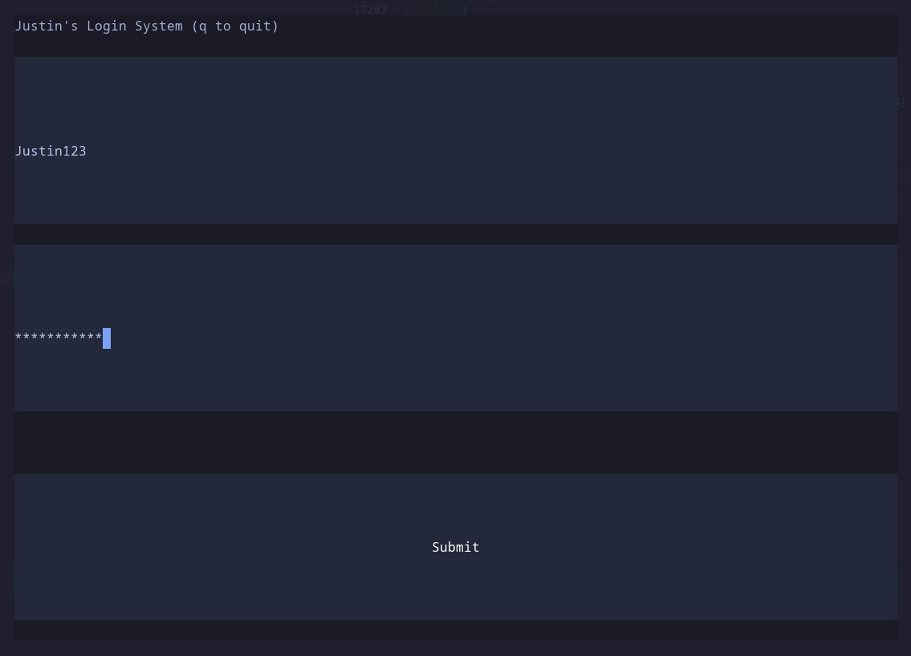
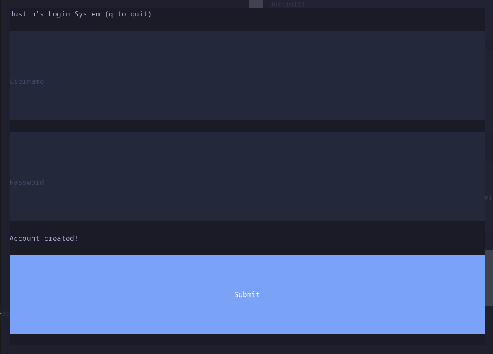
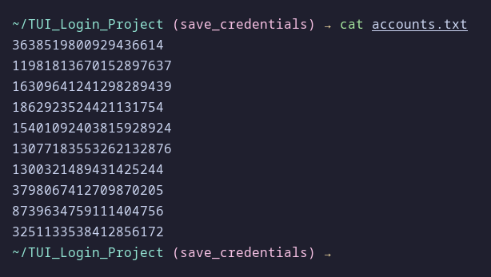

# Justin's Login TUI

### Example input


### Submit info


### Written to file as hash
<p align="center">
  
</p>

## g++ build
```bash
g++ -std=c++20 main.cpp
```

## Windows Build
```bash
x86_64-w64-mingw32-g++ -std=c++20 main.cpp -o app.exe
```